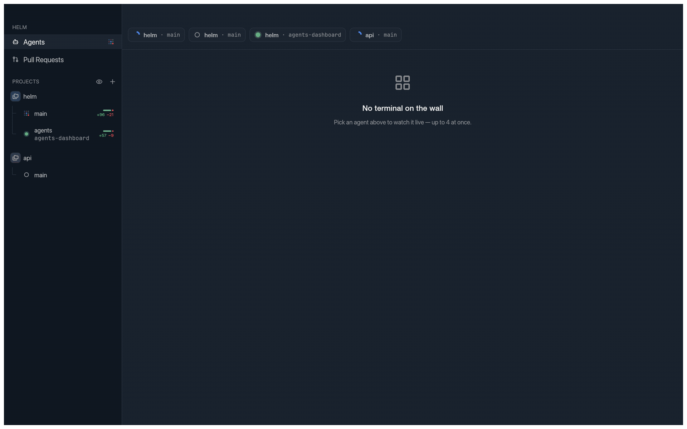
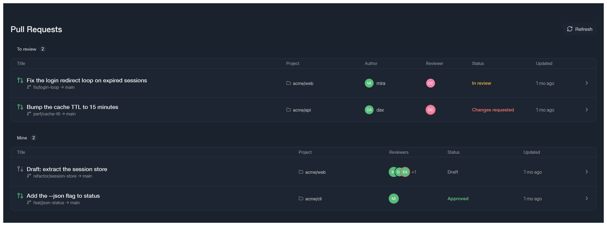
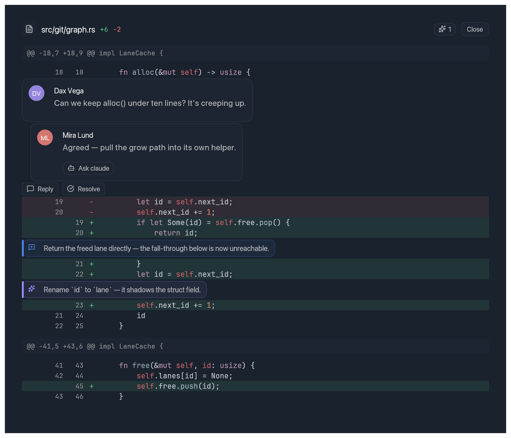

<div align="center">

<picture>
  <source media="(prefers-color-scheme: dark)" srcset="assets/brand/helm-logo.svg">
  <source media="(prefers-color-scheme: light)" srcset="assets/brand/helm-logo-black.svg">
  
</picture>

### *Stay at the Helm.*

**One native macOS window: a real terminal, your git repos, and every AI agent you're running.**

[](https://github.com/davidbonan/Helm/releases/latest)
[](#license)


### [⬇ Download Helm](https://github.com/davidbonan/Helm/releases/latest)

<sub><a href="#features">Features</a> · <a href="#keyboard">Keyboard</a> · <a href="#documentation">Docs</a> · <a href="#build-from-source">Build from source</a> · <a href="CONTRIBUTING.md">Contributing</a></sub>


</div>

> **No Electron. No browser. No daemon.** One native binary, 100% Rust: a
> terminal, a git client and an agent cockpit in a single window that stays out of
> your way.

```sh
curl -fsSL https://raw.githubusercontent.com/davidbonan/Helm/main/install.sh | sh
```

<sub>macOS only. Installs `helm.app` into `/Applications` and launches it.</sub>

**What's in the window**

- **Agents cockpit** — every Claude Code, Codex or opencode running across all
  your repos, live and typeable, four terminals at once.
- **Pull requests** — the PRs you own or must review, across every repo, reviewed
  in a real diff and checked out as a worktree in one click.
- **Real terminal** — native PTY, Ghostty-style keyboard splits, an independent
  set of tabs per repository.
- **Worktrees, first-class** — grouped under their project in the sidebar,
  created in two keystrokes, with a post-create script.
- **Commit graph** — every local ref in one lane layout; check out, rebase, or
  hand the whole rebase to an AI.
- **Git down to the line** — stage by file, hunk or single line; AI-drafted
  commit messages that follow your repo's conventions.
- **Conflicts in place** — a three-pane editor with one-click takes, no
  `<<<<<<<` to untangle.

---

## Features

### Agents — a cross-repo cockpit

The always-visible **Agents** entry at the top of the sidebar opens a **wall of
live terminals** gathering **every running agent across all your repos and
worktrees** — read, scroll and **reply** to each one live.

- **Pick what you watch** — a header strip lists every running agent as a chip
  (state, name, *project · branch*); click one to put its terminal on the wall,
  up to **four at once**, each fully typeable.
- **Laid out like a tab** — the wall is the terminal's own split tree: **drag a
  seam** to resize, **drag a tile's grip** onto another to rearrange or swap.
- **Jump back** — a tile's **jump icon** teleports you to that pane in its
  workspace; `Esc` in a focused terminal reaches the agent as an interrupt.

<p align="center">
  
</p>

Helm also shows **where each workspace stands** right in the sidebar — no hooks,
no config on the agent's side. Claude Code, Codex, opencode, gemini, aider and
amp are detected out of the box.

- **● Working** · **● Done** (green, unread completion) · **● Idle** — the green
  clears when you look (focus) or reply (typing).
- Process-gated detection tuned to **minimize false positives** (`cargo build`,
  `vim` and `htop` won't trip it), and a **native macOS notification** when an
  agent finishes a turn in another workspace.

<p align="center">
  
</p>

Details → [`specs/agents.md`](specs/agents.md)

### Pull requests — reviewed without leaving the app

The **Pull Requests** entry right below Agents gathers, across every repo in the
workspace, the PRs **you authored** and the ones **waiting on your review** —
GitHub through the `gh` CLI, Bitbucket Cloud through its REST API. No extra
runtime dependency, and no token in a config file: the sidebar row just carries
the count of what is actually actionable.

- **Grouped and current** — *To review* then *Mine*, with status, project,
  reviewers and age; a PR **stacked** on another nests under it as a tree. A slow
  background tick keeps the list fresh and never wipes rows on a failed refresh.
- **Review in a real diff** — the PR's changed files **without cloning the
  branch**, comment on any line, reply to existing threads, browse **per commit**,
  then **Approve · Request changes · Comment** from a composer that spells out
  exactly what it will post.
- **Hand it over, or take it over** — **Ask Claude** on a whole PR or a single
  thread launches your agent in that PR's worktree; **Checkout** brings the source
  branch up as a worktree (fetched first, forks included) and activates it.

<p align="center">
  
  <br>
  
</p>

Details → [`specs/pull-requests.md`](specs/pull-requests.md)

### Terminal — Ghostty-style keyboard splits

The center of the workspace is a **real terminal** — native PTY, full VTE
emulation, scrollback, selection and copy, ANSI palette, global font zoom — not a
glorified output pane.

- **Keyboard splits** — `⌘D` splits right, `⌘⇧D` splits bottom, `⌘⌥←/→/↑/↓`
  moves focus, `⌘W` closes the pane (or the tab when it's the last one).
- **Per-repo tabs** — each tab is a tree of splits; switching repos restores its
  terminals exactly as you left them.
- **Built for agent CLIs** — `⇧↵` and `⌥↵` send the newline sequences Claude Code
  and Codex expect; signals and arrows are forwarded untouched.

<p align="center">
  
</p>

Details → [`specs/terminal.md`](specs/terminal.md)

### Worktrees — first-class citizens

Stop juggling `git worktree` by hand. Helm **groups each project** in the
sidebar — the main worktree on top, linked worktrees indented below — each a
fully independent workspace with its own tabs, splits and git session.

- **Two keystrokes to a worktree** — the `+` on a project's root opens a modal
  with an autocomplete over eligible branches, a pre-filled name and a
  configurable base folder.
- **Post-create script** — your setup (`./setup.sh`, `pnpm i`, …) runs in the new
  worktree's first terminal automatically, with the `HELM_*` environment exported.
- **Always in sync** — worktrees created or removed outside the app are
  discovered and purged automatically; **Delete from disk** is one click, instant
  when clean, confirmed when dirty, refused when locked.

<p align="center">
  
</p>

Details → [`specs/worktrees.md`](specs/worktrees.md)

### Git graph — every ref, and AI rebase

Flip the center zone from terminal to **commit graph** with `⌘⇧G`. It walks
**all** your local refs — branches, remotes, tags — laying out the lanes with
decorations, and turns history into something you can actually navigate.

- **Inspect anything** — click a commit to see its metadata and changed files in
  the sidebar; click a file for a full-screen, read-only diff.
- **Search** — `⌘F` filters the loaded commits and cycles through matches.
- **Act from the graph** — double-click a branch chip to check it out (automatic
  safety stash, smart remote handling), or right-click any chip for **checkout ·
  worktree · branch · rebase · interactive rebase · AI rebase · delete**.

<p align="center">
  
</p>

**AI rebase** — right-click a branch and pick **AI rebase onto `<branch>`**. Helm
hands the replay to your configured agentic CLI (`claude -p`,
`codex exec --full-auto`, `opencode run`): it runs *inside the repo*, replays your
commits and **resolves the conflicts itself**, honoring a free-text instruction
like *"squash everything into a single commit."*

- **You stay at the helm** — a recap modal shows the source → target and the
  commits to replay before anything runs. `git push` is **denied** to the agent,
  and the result is verified against the repo.
- **Or drive it yourself** — a full **Interactive rebase** page (Pick / Reword /
  Squash / Fixup / Drop, validated live, todo injected without ever opening an
  editor).

<p align="center">
  
</p>

### Staging — git down to the line

The right sidebar is a focused, real-time git client — **unstaged · staged ·
commit**, refreshed on every action and on disk change, with `⌘↵` to commit.

- **Granular staging** — stage and unstage by **file, hunk, or individual line**
  straight from the diff view.
- **AI commit messages** — a ✨ button drafts a summary + description from your
  staged changes, **following the repo's existing commit conventions**.
- **Uncommitted at a glance** — every dirty repo in the left sidebar carries a
  green/red **ratio bar** with a `+N −M` line count.

<p align="center">
  
</p>

Details → [`specs/git.md`](specs/git.md)

### Conflicts — resolved in place

When a merge or rebase stops on a conflict, Helm opens a **three-pane editor** in
the center — **ours** and **theirs** side by side, the **merged result**
live-editable below. No `<<<<<<<` markers to hand-untangle.

- **Take a side in one click** — accept *ours*, *theirs*, both (in either order
  via `⇅`), or edit the merged output; each conflict tracks its own resolved state.
- **Know when you're done** — the toolbar counts the conflicts and the sidebar
  splits files into **Conflicted** and **Resolved**, so **Continue** only lights
  up once everything is settled.
- Handles **both-modified** and **added-by-both** inline; binary and oversize
  files get a file-level take, and rarer kinds fall back to the terminal.

<p align="center">
  
</p>

Details → [`specs/conflicts.md`](specs/conflicts.md)

### CLI — open it from anywhere

Install the shell command once (*Preferences › Terminal › Shell command*) and
`helm .` opens the repository you are standing in, from any subdirectory — a
worktree path lands straight on that worktree. Helm stays a **single instance**:
the command hands the target to the window already open.

```sh
helm                                  # launch
helm .                                # open the repo containing the current directory
helm ~/dev/api.worktrees/feature-x    # open that worktree
```

Other applications get the same door through the `helm://open?path=…` URL
scheme — a Raycast script, an Alfred workflow, a link in your notes.

Details → [`specs/cli.md`](specs/cli.md)

### Preferences — make it yours

A full-window **Preferences** (`⌘,`) with a left nav and focused settings cards:
appearance (light / dark / auto and named themes), git defaults, the keyboard
map, terminal, agent providers, per-project setup, and built-in app updates.

<p align="center">
  
</p>

Details → [`specs/preferences.md`](specs/preferences.md)

---

## Keyboard

| Shortcut | Action |
|---|---|
| `⌘O` | Open Folder → add a repo |
| `⌘⌃0` | Open the Agents dashboard |
| `⌘⌃1…9` | Switch repository |
| `⌃Tab` / `⌃⇧Tab` | Cycle repository next / previous |
| `⌘1…9` | Switch tab |
| `⌘T` | New terminal tab |
| `⌘D` / `⌘⇧D` | Split right / bottom |
| `⌘⌥←/→/↑/↓` | Move pane focus |
| `⌘W` | Close pane / tab |
| `⌘B` / `⌘G` | Toggle left / right sidebar |
| `⌘⇧G` | Toggle Terminal ⇄ Git graph |
| `⌘F` | Search in the graph |
| `⌘↵` | Commit |
| `⌘,` | Preferences |

Full reference: [`specs/keybindings.md`](specs/keybindings.md).

## Built with

`eframe` / `egui` (GPU UI, 100% Rust) · `alacritty_terminal` (grid + VTE) ·
`portable-pty` (PTY) · `git2` / libgit2 (status, index, diff, commit) ·
`crossbeam-channel` (UI ⇄ worker threads). macOS only.

## Build from source

```sh
cargo run                 # Compile and launch the app
cargo run --release       # Optimized build
cargo test                # Run the tests (unit + business e2e + headless UI e2e)
cargo fmt                 # Format (rustfmt)
cargo clippy -- -D warnings   # Lint (CI-strict)
```

The [`rust-toolchain.toml`](rust-toolchain.toml) pins the `stable` channel and
the `rustfmt` + `clippy` components.

## Documentation

The `specs/` folder freezes the product intent; `specs/plan/` tracks execution.

<details>
<summary><b>Spec index</b></summary>

| Spec | Contents |
|---|---|
| [`overview.md`](specs/overview.md) | Goal, 3-zone layout, locked decisions |
| [`terminal.md`](specs/terminal.md) | PTY, emulation, splits, focus, scrollback |
| [`git.md`](specs/git.md) | Status, granular staging, diff, commit, graph, rebase |
| [`worktrees.md`](specs/worktrees.md) | Worktree grouping, create / delete, discovery |
| [`conflicts.md`](specs/conflicts.md) | In-app conflict editor, takes, resolve & continue |
| [`agents.md`](specs/agents.md) | Agent detection, activity badges, the terminals wall |
| [`pull-requests.md`](specs/pull-requests.md) | PR cockpit, in-app review, checkout as worktree |
| [`preferences.md`](specs/preferences.md) | Preferences page & settings |
| [`update.md`](specs/update.md) | Distribution & built-in app update |
| [`cli.md`](specs/cli.md) | `helm <path>`, the `helm://` scheme, single instance |
| [`keybindings.md`](specs/keybindings.md) | Complete shortcut reference |
| [`design-system.md`](specs/design-system.md) | Tokens & components |

</details>

## Release

CI ([`.github/workflows/release.yml`](.github/workflows/release.yml)) runs the
tests, builds the signed `.app` bundle, and publishes a GitHub Release with the
`helm-macos.zip` asset on every `v<version>` tag matching `Cargo.toml`.

## Contributing

Contributions are welcome. See [`CONTRIBUTING.md`](CONTRIBUTING.md) for the
architecture overview, the three-level test loop, and the `fmt` + `clippy` +
`test` gate to run before opening a pull request.

## License

Licensed under either of **Apache License, Version 2.0**
([`LICENSE-APACHE`](LICENSE-APACHE)) or the **MIT license**
([`LICENSE-MIT`](LICENSE-MIT)), at your option.

<details>
<summary>Bundled fonts & contributions</summary>

Bundled fonts keep their own licenses: JetBrains Mono
([`assets/JetBrainsMono-LICENSE`](assets/JetBrainsMono-LICENSE)) and Symbols
Nerd Font ([`assets/SymbolsNerdFont-LICENSE`](assets/SymbolsNerdFont-LICENSE)).

Unless you explicitly state otherwise, any contribution intentionally submitted
for inclusion in the work by you, as defined in the Apache-2.0 license, shall be
dual licensed as above, without any additional terms or conditions.

</details>
