<div align="center">

<picture>
  <source media="(prefers-color-scheme: dark)" srcset="assets/brand/helm-logo.svg">
  <source media="(prefers-color-scheme: light)" srcset="assets/brand/helm-logo-black.svg">
  
</picture>

### *Stay at the Helm.*

**A native, keyboard-driven dev workspace for macOS — a terminal, your git repos, and an AI-aware git graph in one window.**


</div>

<p align="center">
  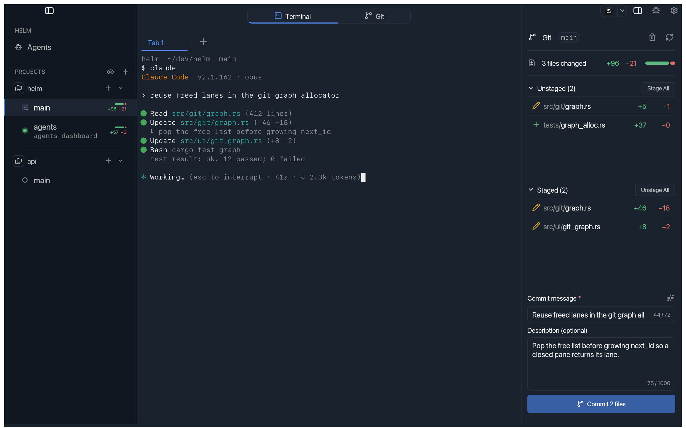
</p>

---

**Helm** is a single-window development environment written in **Rust**, built
around a real terminal. Navigate your git repositories on the left, work in a
splittable terminal in the center, and drive git — status, granular staging,
and a full commit graph — on the right. No Electron, no browser, no daemon: a
native macOS app that stays out of your way.

```sh
curl -fsSL https://raw.githubusercontent.com/davidbonan/Helm/main/install.sh | sh
```

> macOS only. Installs `Helm.app` into `/Applications` and launches it.

---

## Features

### Terminal-first, Ghostty-style splits

The center of the workspace is a **real terminal** (native PTY + full VTE
emulation + scrollback), not a glorified output pane. Split it from the
keyboard, fly between panes, and keep an independent set of tabs **per
repository** — restored when you switch back.

- **Keyboard splits** — `⌘D` splits right, `⌘⇧D` splits bottom, `⌘⌥←/→/↑/↓`
  moves focus, `⌘W` closes the pane (or the tab when it's the last one).
- **Per-repo tabs** — each tab is a tree of splits; switching repos restores its
  terminals exactly as you left them.
- **Built for agent harnesses** — `⇧↵` and `⌥↵` send the newline sequences
  Claude Code and Codex expect; signals and arrows are forwarded untouched.
- Scrollback, text selection/copy, ANSI palette, global font zoom.

<p align="center">
  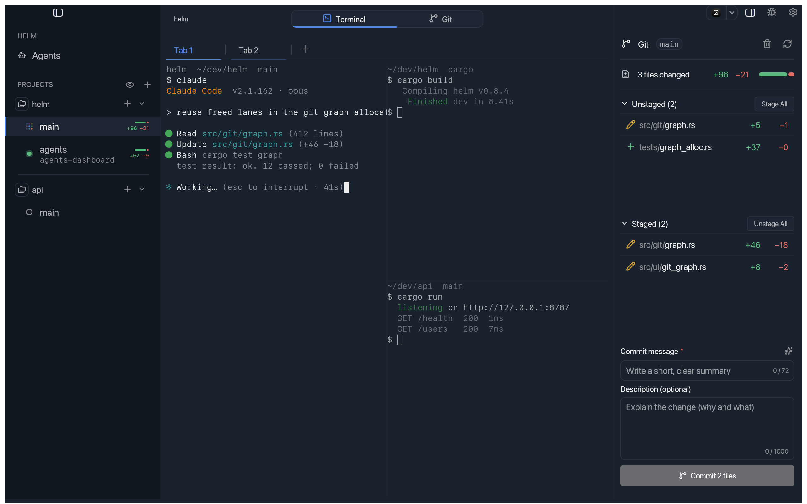
</p>

---

### A genuinely great Git graph

Flip the center zone from terminal to **commit graph** with `⌘⇧G`. It walks
**all** your local refs — branches, remotes, tags — laying out the lanes with
decorations, and turns history into something you can actually navigate.

- **Inspect anything** — click a commit to see its metadata and changed files in
  the sidebar; click a file for a full-screen, read-only diff.
- **Search** — `⌘F` filters the loaded commits and cycles through matches.
- **Act from the graph** — double-click a branch chip to check it out (with an
  automatic safety stash and smart remote handling), or right-click any
  chip/row for **checkout · create worktree · create branch · rebase ·
  interactive rebase · AI rebase · copy name · delete**.
- Read-only by design: history is never rewritten except through the explicit
  actions you choose.

<p align="center">
  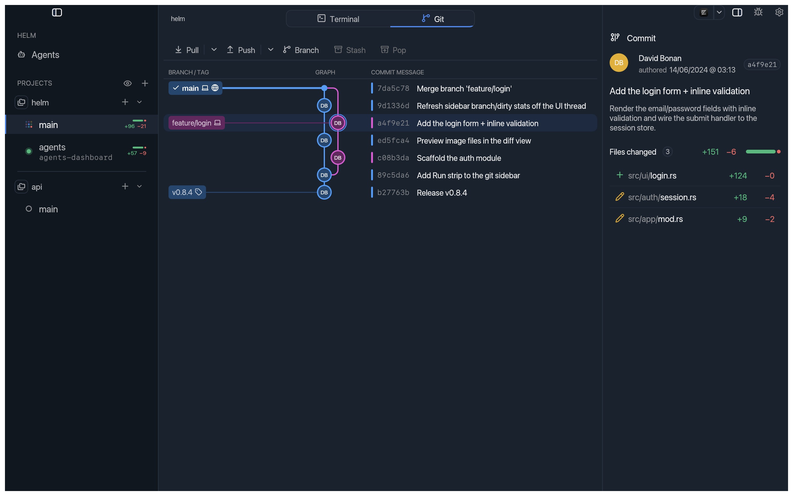
</p>

---

### Worktrees as first-class citizens

Stop juggling `git worktree` by hand. Helm **groups each project** in the
sidebar — the main worktree on top, linked worktrees indented below — each a
fully independent workspace with its own tabs, splits and git session.

- **Create a worktree in two keystrokes** — the `+` on a project's root opens a
  modal with an autocomplete over eligible branches (local and remote-tracking),
  a pre-filled name, and a configurable base folder.
- **Post-create script** — run your setup (`./setup.sh`, `pnpm i`, …) in the new
  worktree's first terminal automatically, with `HELM_WORKTREE_PATH`,
  `HELM_WORKTREE_BRANCH`, `HELM_PROJECT_ROOT` and `HELM_SOURCE_BRANCH` exported.
- **Always in sync** — worktrees created or removed outside the app are
  discovered and purged automatically. **Delete from disk** is one click:
  instant when clean, confirmed when dirty, refused when locked.
- **Hide what you're not using** — tuck idle projects away from the eye dropdown
  next to *Projects* (or the project's context menu); they stay one click from
  coming back and the choice persists.

<p align="center">
  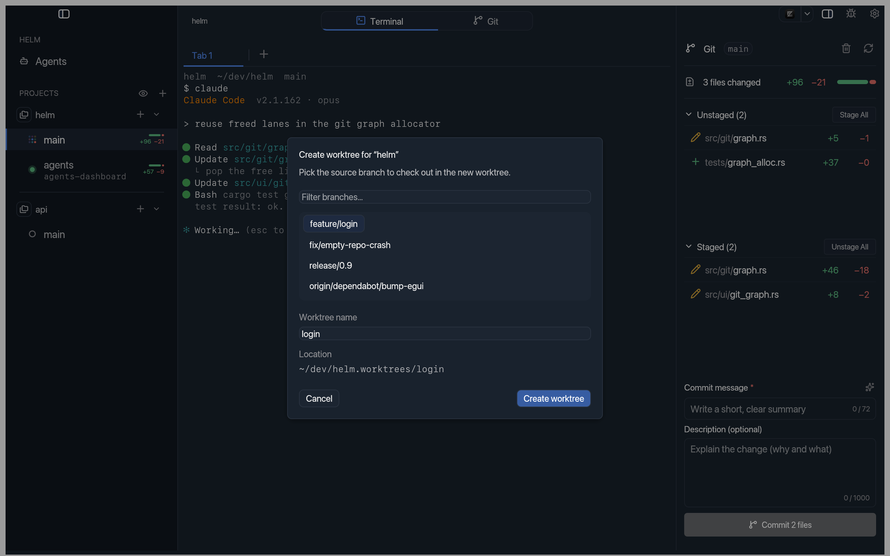
</p>

---

### Rebase with AI

Right-click a branch and pick **AI rebase onto `<branch>`**. Helm hands the
replay to your configured **agentic CLI** — it runs *inside the repo*, replays
your commits, and **resolves the conflicts itself**, honoring a free-text
instruction like *"squash everything into a single commit."*

- **You stay at the helm** — a recap modal shows the source → target and the
  commits to replay before anything runs. `git push` is **denied** to the agent;
  the result is verified against the repo (Completed / Unchanged / In progress).
- **Pick your flavor** — plain `Rebase onto`, a full **Interactive rebase** page
  (Pick / Reword / Squash / Fixup / Drop, validated live, todo injected without
  ever opening an editor), or the **AI rebase** above.
- Providers: `claude -p`, `codex exec --full-auto`, `opencode run`.

<p align="center">
  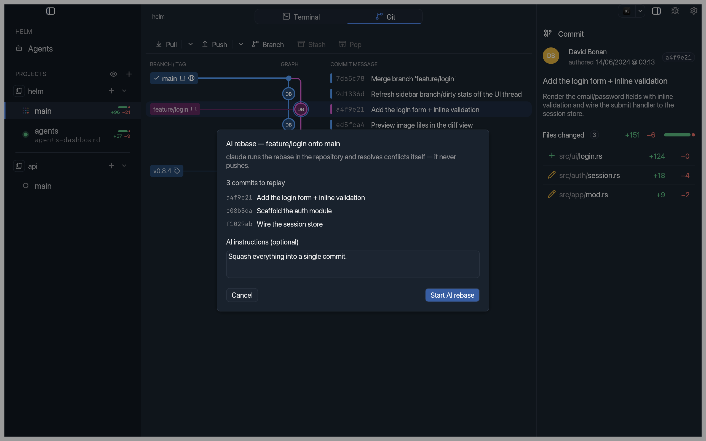
</p>

---

### Git, down to the line

The right sidebar is a focused, real-time git client: **unstaged · staged ·
commit**, refreshed on every action and on disk change.

- **Granular staging** — stage and unstage by **file, hunk, or individual line**
  straight from the diff view.
- **AI commit messages** — a ✨ button drafts a summary + description from your
  staged changes via your configured AI CLI, **following the repo's existing
  commit conventions**.
- **Uncommitted at a glance** — every dirty repo in the left sidebar carries a
  green/red **ratio bar** with a `+N −M` line count, so you see what's
  outstanding without opening it.
- Diff overlay with keyboard file traversal, a read-only branch indicator, and
  `⌘↵` to commit.

<p align="center">
  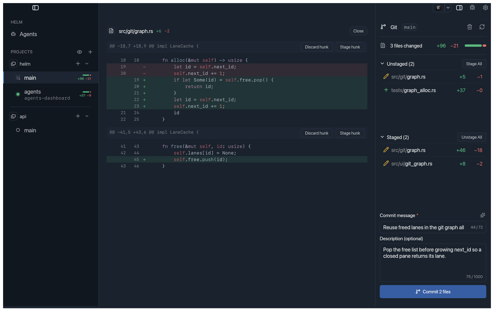
</p>

---

### Resolve conflicts in place

When a merge or rebase stops on a conflict, Helm opens a **three-pane editor**
in the center — **ours** and **theirs** side by side, the **merged result**
live-editable below. No `<<<<<<<` markers to hand-untangle.

- **Take a side in one click** — accept *ours*, *theirs*, both (in either order
  via `⇅`), or edit the merged output directly; each conflict tracks its own
  *resolved / unresolved* state.
- **Know when you're done** — the toolbar counts the conflicts and the sidebar
  splits files into **Conflicted** and **Resolved**, so **Continue** only lights
  up once everything is settled (**Abort** backs the whole operation out).
- Handles **both-modified** and **added-by-both** inline; binary and oversize
  files get a file-level take, and rarer kinds fall back to the terminal.

<p align="center">
  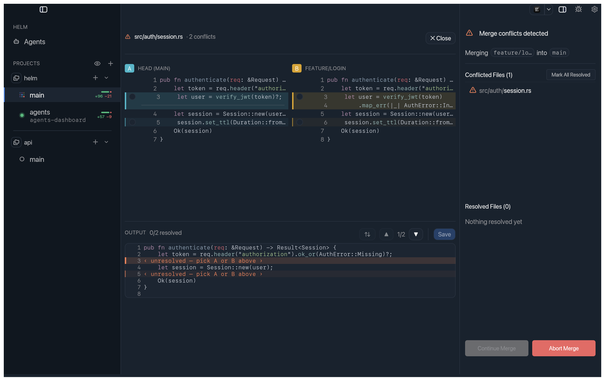
</p>

---

### Know what your agents are doing — at a glance

Run Claude Code, Codex, opencode, gemini, aider or amp in any pane and Helm
shows **where each workspace stands** in the sidebar — no hooks, no config on
the agent's side.

- **● Working** (spinner) · **● Done** (green, unread completion) · **● Idle**
  (gray). The green clears when you look (focus) or reply (typing).
- Process-gated detection tuned to **minimize false positives** — `cargo build`,
  `vim` and `htop` won't trip it.
- A **native macOS notification** fires the moment an agent finishes a turn while
  you're in another workspace.

<p align="center">
  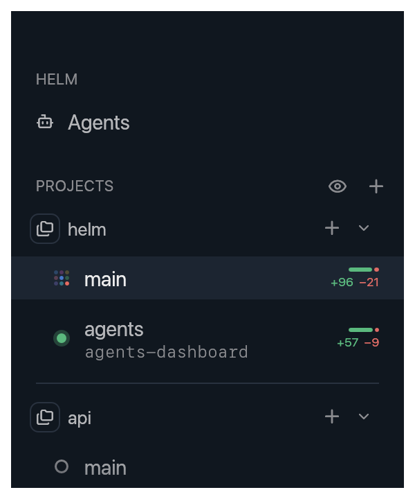
</p>

---

### A cross-repo cockpit for your agents

The always-visible **Agents** entry at the top of the sidebar opens a dashboard
that gathers **every running agent across all your repos and worktrees** into one
view — and lets you read, scroll and **reply** to each one live. Two layouts,
switched from the titlebar and remembered across launches:

- **List** — a two-pane cockpit: agents grouped by project on the left (branch
  chip, live state, *Finished 3m ago*), the selected agent's terminal mirrored
  **live and fully interactive** on the right.
- **Columns** — a **wall of live terminals**, one column per worktree under a
  single *project · branch* header (a project's columns share its hue), every agent
  a card you can type into. The focused terminal takes whatever height its column
  has left; the shared column width is resizable, with horizontal scroll when they
  overflow.
- **Click** a row to mirror it; the **jump icon** teleports you straight to that
  pane in its workspace. `Esc` in a focused terminal reaches the agent as an
  interrupt; otherwise it leaves the dashboard.

<p align="center">
  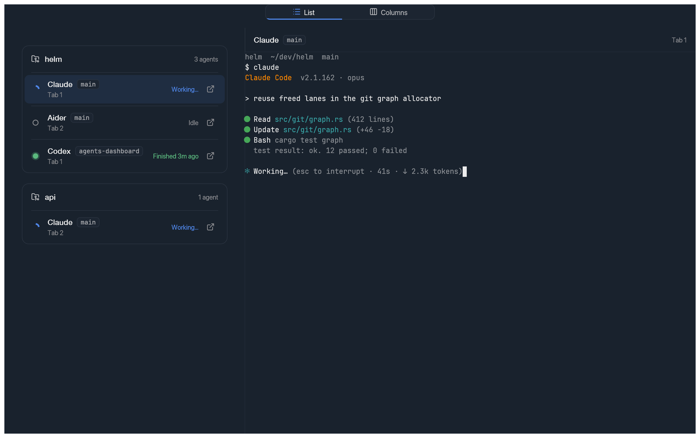
  <br>
  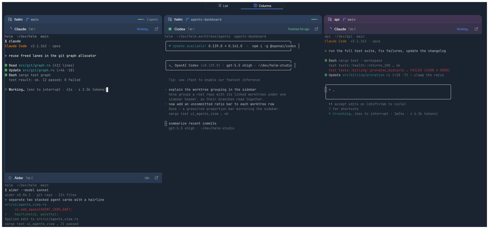
</p>

---

### Open it from anywhere

Install the shell command once (*Preferences › Terminal › Shell command*) and
`helm .` opens the repository you are standing in — from any subdirectory, and a
worktree path lands straight on that worktree. An unknown project is imported
with its whole worktree group; a known one is just raised and focused. Helm
stays a **single instance**: the command hands the target to the window already
open instead of starting a second one.

```sh
helm                                  # launch
helm .                                # open the repo containing the current directory
helm ~/dev/api.worktrees/feature-x    # open that worktree
```

Other applications get the same door through the `helm://open?path=…` URL
scheme — a Raycast script, an Alfred workflow, a link in your notes.

### Make it yours

A full-window **Preferences** (`⌘,`) with a left nav and focused settings cards:
appearance (light / dark / auto and named themes), git defaults, the keyboard
map, terminal, agent providers, per-project setup, and built-in app updates.

<p align="center">
  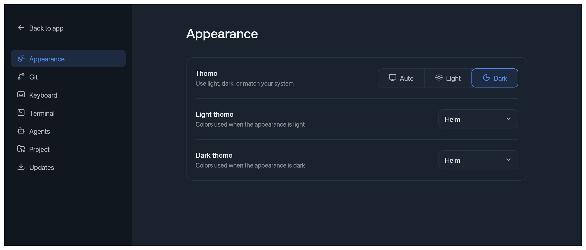
</p>

---

## Keyboard

| Shortcut | Action |
|---|---|
| `⌘O` | Open Folder → add a repo |
| `⌘⌃1…9` | Switch repository |
| `⌃Tab` / `⌃⇧Tab` | Cycle repository next / previous |
| `⌘1…9` | Switch tab |
| `⌘T` | New terminal tab |
| `⌘D` / `⌘⇧D` | Split right / bottom |
| `⌘⌥←/→/↑/↓` | Move pane focus |
| `⌘W` | Close pane / tab |
| `⌘B` / `⌘G` | Toggle left / right sidebar |
| `⌘⇧G` | Toggle Terminal ⇄ Git graph |
| `⌘F` | Search in the graph |
| `⌘↵` | Commit |
| `⌘,` | Preferences |

Full reference: [`specs/keybindings.md`](specs/keybindings.md).

## Built with

`eframe` / `egui` (GPU UI, 100% Rust) · `alacritty_terminal` (grid + VTE) ·
`portable-pty` (PTY) · `git2` / libgit2 (status, index, diff, commit) ·
`crossbeam-channel` (UI ⇄ worker threads). macOS only.

## Build from source

```sh
cargo run                 # Compile and launch the app
cargo run --release       # Optimized build
cargo test                # Run the tests (unit + business e2e + headless UI e2e)
cargo fmt                 # Format (rustfmt)
cargo clippy -- -D warnings   # Lint (CI-strict)
```

The [`rust-toolchain.toml`](rust-toolchain.toml) pins the `stable` channel and
the `rustfmt` + `clippy` components.

## Documentation

The `specs/` folder freezes the product intent; `specs/plan/` tracks execution.

| Spec | Contents |
|---|---|
| [`overview.md`](specs/overview.md) | Goal, 3-zone layout, locked decisions |
| [`terminal.md`](specs/terminal.md) | PTY, emulation, splits, focus, scrollback |
| [`git.md`](specs/git.md) | Status, granular staging, diff, commit, graph, rebase |
| [`worktrees.md`](specs/worktrees.md) | Worktree grouping, create / delete, discovery |
| [`agents.md`](specs/agents.md) | AI agent detection & activity badges |
| [`preferences.md`](specs/preferences.md) | Preferences page & settings |
| [`update.md`](specs/update.md) | Distribution & built-in app update |
| [`cli.md`](specs/cli.md) | `helm <path>`, the `helm://` scheme, single instance |
| [`keybindings.md`](specs/keybindings.md) | Complete shortcut reference |
| [`design-system.md`](specs/design-system.md) | Tokens & components |

## Release

CI ([`.github/workflows/release.yml`](.github/workflows/release.yml)) runs the
tests, builds the signed `.app` bundle, and publishes a GitHub Release with the
`helm-macos.zip` asset on every `v<version>` tag matching `Cargo.toml`.

## Contributing

Contributions are welcome. See [`CONTRIBUTING.md`](CONTRIBUTING.md) for the
architecture overview, the three-level test loop, and the `fmt` + `clippy` +
`test` gate to run before opening a pull request.

## License

Licensed under either of

- Apache License, Version 2.0 ([`LICENSE-APACHE`](LICENSE-APACHE))
- MIT license ([`LICENSE-MIT`](LICENSE-MIT))

at your option.

Bundled fonts keep their own licenses: JetBrains Mono
([`assets/JetBrainsMono-LICENSE`](assets/JetBrainsMono-LICENSE)) and Symbols
Nerd Font ([`assets/SymbolsNerdFont-LICENSE`](assets/SymbolsNerdFont-LICENSE)).

Unless you explicitly state otherwise, any contribution intentionally submitted
for inclusion in the work by you, as defined in the Apache-2.0 license, shall be
dual licensed as above, without any additional terms or conditions.
